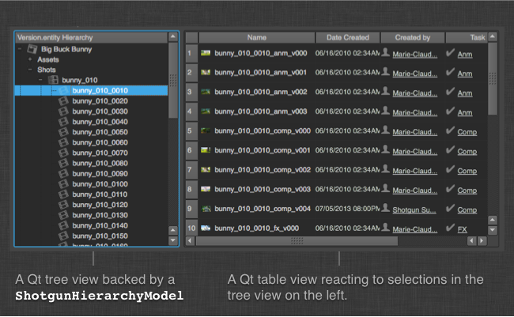

Shotgun Hierarchy Model
######################################

.. currentmodule:: shotgun_model

Introduction
======================================

The shotgun hierarchy data model helps you build responsive, data rich
applications quickly, leveraging Qt's built-in model/view framework to represent
your production hierarchy.

The Shotgun Hierarchy Model is a custom Qt Model specialized to represent your
Shotgun production hierarchy as defined in your site's
`Tracking Settings <https://support.shotgunsoftware.com/hc/en-us/articles/219031138-Project-Tracking-Settings>`_.
The hierarchy represented by the model is dynamically constructed based on
a ``seed_entity_field`` which represents the target of the hierarchy (i.e. what
you're trying to drill down to in view using the model).

Like the :class:`ShotgunModel`, the :class:`.ShotgunHierarchyModel` uses a disk based
cache and runs queries asynchronously to Shotgun in the background for
performance. You derive your own model class from it, set up a query, and then
hook up your model to a Qt View which will draw the data. The class contains
several callbacks and allows for extensive customization, yet tries to shadow
and encapsulate a lot of the details.

.. image:: images/model_inheritance.png

Why should I use the Shotgun Hierarchy Model?
---------------------------------------------

Using the Shotgun Hierarchy Model means switching to Model/View based
programming. While there is perhaps slightly more overhead to get started with
this, there are many benefits. The Shotgun Hierarchy Model (and the
corresponding delegates and Shotgun View components) is an attempt to bridge
this gap and make it quick and painless to get started with Qt Model/View
programming.

Qt provides a strong and mature Model/View hierarchy which is robust and easy to
work with. If you are not familiar with it, please check the following links:

- Tutorial: http://qt-project.org/doc/qt-4.8/modelview.html
- Technical details: http://qt-project.org/doc/qt-4.8/model-view-programming.html

The benefits with this approach will become evident as you scale your UIs and
their complexity. Developing code and tools where the data and the UI is
combined will work in simple scenarios but for data rich applications this
approach becomes hard to maintain, difficult to reuse and typically scales
poorly as the dataset complexity grows. By leveraging Qt's built-in
functionality, you get access to a mature and well documented toolbox that makes
it quick to develop tools:

- A hierarchy model instance represents a single Shotgun
  :meth:`~shotgun-api3:shotgun_api3.Shotgun.nav_expand()` query. The model is
  lazy-loaded as each time you expand an item in the view, the children of that
  item are queried.
- The model is cached, meaning that all data is fetched in the background in
  worker threads. This means that the data in your UI will load up instantly and
  you never have to wait for Shotgun. If the query result is different than the
  cached result, the view will be updated on the fly as the data arrives.
- With Qt you have access to selection models, making it easy to create
  consistent selection behavior, even across multiple views, with full keyboard
  support.
- With Qt proxy models you can easily create interactive searching and filtering
  on the client side.
- Views and models are optimized and will perform nicely even if you have
  thousands of items loaded.
- With an attached view, you can easily control the Qt *delegates* system,
  making it easy to draw custom UIs for each item.

Shotgun Hierarchy Model Hello World
------------------------------------

A hello world style example would look something like this, assuming this code
is inside a toolkit app::

    # import the shotgun model module from shotgunutils framework
    shotgun_model = sgtk.platform.import_framework(
        "tk-framework-shotgunutils", "shotgun_model")

    # Create a standard Qt Tree View
    view = QtGui.QTreeView(parent_widget)

    # Set up our data backend
    model = shotgun_model.SimpleShotgunHierarchyModel(parent_widget)

    # Tell the view to pull data from the model
    view.setModel(self._hierarchy_model)

    # build a hierarchy that encompases all your projects
    # targeting entities linked to the "entity" field on "Version" entities
    model.load_data("Version.entity")

The above code will create a standard Qt tree view for your site (all projects)
drilling down to entities with linked versions.

Beyond Hello World
---------------------------------

The simple setup outlined above could be extended in the following ways:

- If you need more control of how the data is being retrieved, consider instead
  creating your own class and derive from :class:`.ShotgunHierarchyModel`. This
  makes it possible to customize the data as it arrives from Shotgun and how it
  will be displayed by the view.
- If you want to retrieve results from your view, connect signals to the view's
  selection model. The items in the view hold all the information you need to
  query all the target entities under that level of the hierarchy. For example,
  an item that represents a ``Sequence`` entity in a view stores all the
  required information for querying target entities for all of its ``Shots``.
- If you want to cull out items from the model, for example only to show items
  matching a particular search criteria, use a Proxy Model (typically
  :class:`~PySide.QtGui.QSortFilterProxyModel`).
- If you want to control the way items are displayed in the view, consider using
  the Shotgun delegates module which is part of the Qt widgets framework. For
  more information, see :class:`~tk-framework-qtwidgets:views.WidgetDelegate`

SimpleShotgunHierarchyModel
=====================================================

Convenience wrapper around the Shotgun Hierarchy Model for quick and easy
access. Use this when you want to prototype data modeling or if your are looking
for a simple hierarchy without any customization. All you need to do is to
instantiate the class (typically once, in your constructor) and then call
:meth:`.SimpleShotgunHierarchyModel.load_data()` to specify the type of
hierarchy to build in the model. Subsequently, call
:meth:`~SimpleShotgunModel.load_data()` whenever you wish to change the
hierarchy represented by the model.

This class derives from :class:`ShotgunHierarchyModel` so all the customization
methods available in the normal ShotgunModel can also be subclassed from this
class.

.. autoclass:: SimpleShotgunHierarchyModel
    :show-inheritance:
    :members:

ShotgunHierarchyModel
=====================================================

A Qt Model representing a Shotgun query.

This class implements a standard :class:`~PySide.QtCore.QAbstractItemModel`
specialized to hold the contents of a particular shotgun API
:meth:`~shotgun-api3:shotgun_api3.Shotgun.nav_expand()` query. It is cached and
refreshes its data asynchronously.

.. autoclass:: ShotgunHierarchyModel
    :inherited-members:
    :members:
    :exclude-members: canFetchMore,
                      fetchMore,
                      hasChildren,
                      reset,
                      clear,
                      destroy,
                      hard_refresh,
                      is_data_cached

    **Loading the Hierarchy Data**

    These methods are used by subclasses to define the Shotgun query that loads
    and caches the hierarchy items and refreshes them once cached.

    .. automethod:: _load_data
    .. automethod:: destroy
    .. automethod:: hard_refresh
    .. automethod:: is_data_cached

    **Customizing the Hierarchy Items**

    The following methods can be used by subclasses to customize the model
    and the information it displays when attached to a view.

    .. automethod:: _before_data_processing
    .. automethod:: _finalize_item
    .. automethod:: _item_created
    .. automethod:: _load_external_data
    .. automethod:: _populate_item
    .. automethod:: _populate_default_thumbnail
    .. automethod:: _set_tooltip

    **Instance Methods**

