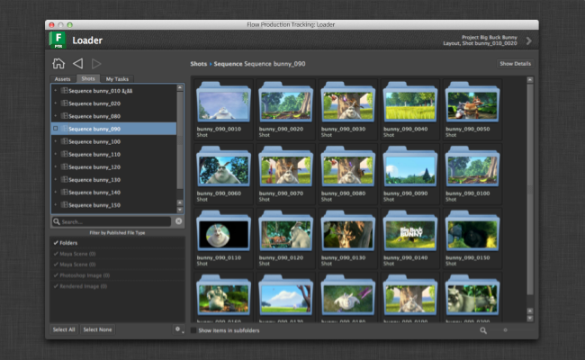

Shotgun Model
######################################

.. currentmodule:: shotgun_model

Introduction
======================================

The shotgun data model helps you build responsive, data rich applications quickly and leverage
Qt's built-in model/view framework

The Shotgun Model is a custom Qt Model specialized for Shotgun Queries. It uses a disk based cache
and runs queries asynchronously to Shotgun in the background for performance. In a nut shell, you
derive your own model class from it, set up a query, and then hook up your model to a Qt View which
will draw the data. The class contains several callbacks and allows for extensive customization, yet
tries to shadow and encapsulate a lot of the details.

.. image:: images/model_inheritance.png

Why should I use the Shotgun Model?
---------------------------------------

Using the Shotgun Model means switching to Model/View based programming. While there is perhaps slightly more
overhead to get started with this, there are many benefits. The Shotgun Model (and the corresponding delegates
and Shotgun View components) is an attempt to bridge this gap and make it quick and painless to get started
with Qt Model/View programming.

Qt provides a strong and mature Model/View hierarchy which is robust and easy to work with. If you are not
familiar with it, please check the following links:

- Tutorial: http://qt-project.org/doc/qt-4.8/modelview.html
- Technical details: http://qt-project.org/doc/qt-4.8/model-view-programming.html

The benefits with this approach will become evident as you scale your UIs and their complexity. Developing code
and tools where the data and the UI is combined will work in simple scenarios but for data rich applications
this approach becomes hard to maintain, difficult to reuse and typically scales poorly as the dataset complexity grows.
By leveraging Qts built-in functionality, you get access to a mature and well documented toolbox that makes
it quick to develop tools:

- A Shotgun model instance represents a single shotgun query. With two lines of code you can connect the resultset
  of such a query with a standard Qt list, tree or table.
- The Shotgun model is cached, meaning that all data is fetched in the background in a worker thread. This means that
  the data in your UI will load up instantly and you never have to wait for shotgun. If the query result is different
  than the cached result, the view will be updated on the fly as the data arrives.
- With Qt you have access to SelectionModels, making it easy to create consistent selection behavior, even across
  multiple views. With full keyboard support.
- With Qt proxy models you can easily create interactive searching and filtering on the client side.
- Views and models are optimized and will perform nicely even if you have thousands of items loaded.
- Through the shotgun view module, you can easily control the Qt *delegates* system, making it easy to
  draw custom UIs for each cell in your view.

Shotgun Model Hello World
------------------------------------

A hello world style example would look something like this, assuming this code is inside a
toolkit app::

    # Import the shotgun_model module from the shotgun utils framework
    shotgun_model = tank.platform.import_framework("tk-framework-shotgunutils", "shotgun_model")
    # Set up alias
    ShotgunModel = shotgun_model.ShotgunModel

    # Create a standard Qt Tree View
    view = QtGui.QTreeView(parent_widget)

    # Set up our data backend
    model = shotgun_model.SimpleShotgunModel(parent_widget)

    # Tell the view to pull data from the model
    view.setModel(model)

    # load all assets from Shotgun
    model.load_data(entity_type="Asset")

The above code will create a standard Qt tree view of all assets in Shotgun.

Beyond Hello World
---------------------------------

The simple setup outlined above could be extended in the following ways:

- If you need more control of how the data is being retrieved, consider instead creating
  your own class and derive from :class:`ShotgunModel`. This makes it possible to customize
  the shotgun data as it arrives from Shotgun, control the hierarchy grouping and many other
  things.
- If you want to retrieve results from your view, connect signals to the view's selection model.
- If you want to cull out items from the model, for example only to show items matching a particular
  search criteria, use a Proxy Model (typically :class:`~PySide.QtGui.QSortFilterProxyModel`).
- If you want to control the way items are displayed in the view, consider using the Shotgun delegates
  module which is part of the Qt widgets framework. For more information, see
  :class:`~tk-framework-qtwidgets:views.WidgetDelegate`

Progress Spinner
----------------------

The model emits several signals at various points in its refresh cycle. If you want a spinner
to pop up to indicate that data is being loaded, simply add a :class:`~tk-framework-qtwidgets:overlay_widget.ShotgunModelOverlayWidget`
between your view and model, like this::

    overlay_widget = tank.platform.import_framework("tk-framework-qtwidgets", "overlay_widget")

    # once you have created a view and a model, set up an overlay object to
    # track the model's activity. Whenver the model is loading data,
    # the overlay will show a spinner.

    overlay = overlay_widget.ShotgunModelOverlayWidget(model, view)

If you want to refine how the overlay behaves, simply subclass the class above.
This can be useful if you for example want to display a 'no items found' message whenever
a shotgun query returns zero items.

Data Items
----------------------

The Shotgun Model derives from :class:`~PySide.QtGui.QStandardItemModel` which is a base model which managed the storage
of model data inside a collection of :class:`~PySide.QtGui.QStandardItem` objects. Each of these objects have a number of
standard property and so called *roles*, holding various pieces of data such as icons, colors etc.
The Shotgun Model introduces two new standard roles which can be used by both subclassing and calling
code:

- ``ShotgunModel.SG_DATA_ROLE`` holds the shotgun data associated with an object. In a tree view, only
  leaf nodes have this data defined - other nodes have it set to None. For leaf nodes, it is a standard
  shotgun dictionary containing all the items that were returned by the Shotgun query.
- ``ShotgunModel.SG_ASSOCIATED_FIELD_ROLE`` holds the associated field value for a node. This is contained
  in a dictionary with the keys name and value. For example, for a leaf node this is typically something
  like ``{"name": "code", "value": "AAA_123"}``. For an intermediate node, it may be something such as
  ``{"name": "sg_sequence", "value": {"id": 123, "name": "AAA", "type": "Sequence"} }``.

SimpleShotgunModel
=====================================================

Convenience wrapper around the Shotgun model for quick and easy access. Use this when you want
to prototype data modeling or if your are looking for a simple flat data set reflecting a
shotgun query. All you need to do is to instantiate the class (typically once, in your constructor)
and then call :meth:`SimpleShotgunModel.load_data()` to
specify which shotgun query to load up in the model. Subsequently call
:meth:`~SimpleShotgunModel.load_data()` whenever you
wish to change the Shotgun query associated with the model.

This class derives from :class:`ShotgunModel` so all the
customization methods available in the
normal ShotgunModel can also be subclassed from this class.

.. autoclass:: SimpleShotgunModel
    :show-inheritance:
    :members:

ShotgunEntityModel
=====================================================

Another convenience wrapper around the :class:`ShotgunModel`. This model is useful when you
want to represent a tree view of Sequences, Shots or Assets. By default, the model will
associate standard dark-style Shotgun entity type icons to items in the list.

.. autoclass:: ShotgunEntityModel
    :show-inheritance:
    :members:
    :exclude-members: destroy

ShotgunModel
=====================================================

A Qt Model representing a Shotgun query.

This class implements a standard :class:`~PySide.QtCore.QAbstractItemModel` specialized to hold the contents
of a particular Shotgun query. It is cached and refreshes its data asynchronously.

The model can either be a flat list or a tree. This is controlled by a grouping
parameter which works just like the Shotgun grouping. For example, if you pull
in assets grouped by asset type, you get a tree of data with intermediate data
types for the asset types. The leaf nodes in this case would be assets.

.. autoclass:: ShotgunModel
    :show-inheritance:
    :members:
    :inherited-members:
    :exclude-members: reset

    **Loading & Refreshing the Data**

    These methods are used by subclasses to define the Shotgun query that loads
    and caches the model items and refreshes them once cached.

    .. automethod:: _load_data
    .. automethod:: _refresh_data

    **Customizing the Model Items**

    The following methods can be used by subclasses to customize the model
    and the information it displays when attached to a view.

    .. automethod:: _before_data_processing
    .. automethod:: _before_item_removed
    .. automethod:: _finalize_item
    .. automethod:: _get_additional_columns
    .. automethod:: _get_additional_column_headers
    .. automethod:: _get_columns
    .. automethod:: _item_created
    .. automethod:: _load_external_data
    .. automethod:: _populate_default_thumbnail
    .. automethod:: _populate_item
    .. automethod:: _populate_thumbnail
    .. automethod:: _populate_thumbnail_image
    .. automethod:: _request_thumbnail_download
    .. automethod:: _set_tooltip

    **Instance Methods**